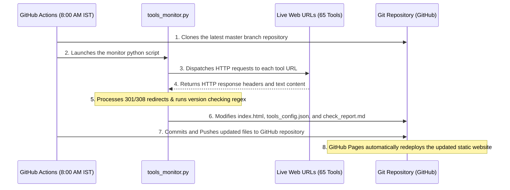

# 📄 AI Tools Directory - Project Report

This document provides a comprehensive report of the project's architecture, components, functionality, frontend/backend specifications, and automation workflow.

---

## 1. Project Contents & Structure
The repository consists of the following key files and directories:

*   **[index.html](file:///d:/CLAUDE%20CODE/ai-tools-directory/index.html)**: The main user-facing frontend of the website. It is a single-page static HTML file styled with modern, responsive CSS.
*   **[tools_config.json](file:///d:/CLAUDE%20CODE/ai-tools-directory/tools_config.json)**: The project's data store (acting as a lightweight database). It contains structured JSON data defining the 65 AI tools (names, URLs, active/dead status, check configurations, and regex patterns for version checks).
*   **[tools_monitor.py](file:///d:/CLAUDE%20CODE/ai-tools-directory/tools_monitor.py)**: The core engine of the project. A Python script that sequentially checks all tool URLs, auto-corrects permanent redirects (301/308) in both HTML and config files, updates the modification date, and generates health reports.
*   **[check_report.md](file:///d:/CLAUDE%20CODE/ai-tools-directory/check_report.md)**: A markdown report generated automatically after each health check, detailing the status of every tool (healthy, blocked, dead, or redirected).
*   **[.github/workflows/daily-check.yml](file:///d:/CLAUDE%20CODE/ai-tools-directory/.github/workflows/daily-check.yml)**: The automation cron job. It runs daily at 8:00 AM IST (2:30 AM UTC) on GitHub Actions to trigger the monitoring script and commit any updates back to the repository.
*   **[requirements.txt](file:///d:/CLAUDE%20CODE/ai-tools-directory/requirements.txt)**: Specifies the Python library dependencies (`requests`, `beautifulsoup4`, `lxml`) needed to run the link checker.
*   **[.gitignore](file:///d:/CLAUDE%20CODE/ai-tools-directory/.gitignore)**: Prevents local configuration files, IDE folders (`.idea/`), and developer environment settings (`.claude/` containing API keys) from leaking into the public repository.

---

## 2. Technical Stack & Build
The directory is built on a minimal, serverless, and highly performant architecture:
*   **Frontend**: Native HTML5 and Vanilla CSS3 (optimized with system font stacks and CSS custom properties for rapid loading speeds, avoiding heavy CSS frameworks).
*   **Automation Engine**: Python 3 utilising the `requests` HTTP library for network checks and `BeautifulSoup4` for programmatic HTML manipulation.
*   **Hosting & CI/CD**: GitHub Actions (free automation containers) and GitHub Pages (free static site hosting directly from the repository's master branch).

---

## 3. Core Functionality (What it does)
*   **Link Verification**: Programmatically queries all 65 external links to ensure they resolve to a valid status code.
*   **Automated Link Correction**: Detects permanent domain redirects (e.g., `chat.openai.com` -> `chatgpt.com`) and updates the hyperlinks directly in `index.html` and `tools_config.json`.
*   **Last Updated Date Bump**: Automatically updates the date badge at the top of `index.html` (e.g., `Last Updated: July 02, 2026`) whenever changes are detected or a daily check runs.
*   **Version Check Flagging**: Monitors select websites for major updates or version drift (like Suno or Midjourney) by running custom regex patterns over the fetched webpage HTML.
*   **Detailed Status Reports**: Compiles all findings into `check_report.md` after every check run.

---

## 4. Limitations (What it doesn't do)
*   **Cloudflare/Anti-Bot Bypassing**: Highly secured AI platforms (e.g., Claude, Perplexity) block basic programmatic requests with a `403 Forbidden` response. These must be checked manually.
*   **Authentication Portal Crawling**: The script cannot log into websites; it can only parse publicly available landing pages.
*   **Visual Interface Checking**: It does not render or check UI elements (buttons, layout alignments, etc.) for visual regression.

---

## 5. Frontend Architecture
The user interface is designed to be highly responsive, modern, and readable:
*   **Visual Style**: Sleek dark-mode aesthetic utilizing premium fonts (`Inter`, `Space Grotesk`), gradients, subtle borders, and micro-interactions on hover.
*   **Organization**: 65 tools grouped into 12 custom categories (such as AI Assistants, Image Generation, Coding, Video Gen, etc.).
*   **Pricing Badges**: Color-coded badges indicating availability status:
    *   `FREE`: Fully free.
    *   `BUDGET`: Under $15/month.
    *   `TRIAL`: Free trial available.
    *   `OPEN`: Open-source weights.
    *   `🔥 HOT`: High popularity.
*   **Branding**: Featuring a high-visibility Instagram follow badge for `@hackthealgorithm.in` in the header, and credit references in the footer.

---

## 6. Backend Architecture
The project does not rely on a traditional database server (like SQL or MongoDB) or a dynamic server runtime (like Node.js or PHP). 
*   **Data Tier**: A flat-file JSON database (`tools_config.json`).
*   **Execution Tier**: `tools_monitor.py` which contains all the checking, scraping, and replacement logic.
*   **Infrastructure Tier**: GitHub's cloud virtual machines (runners) which launch dynamically, execute the script, commit updates, and shut down automatically.

---

## 7. Operational Workflow (How things work)
The step-by-step automation execution pipeline is structured as follows:

1.  **Trigger**: Every morning at 8:00 AM IST, GitHub Actions spins up an Ubuntu container.
2.  **Processing**: The script checks each URL. If a redirect is found or the update timestamp needs changing, the files are modified locally.
3.  **Synchronization**: Changes are committed by `github-actions[bot]` and pushed back to the master branch.
4.  **Deployment**: GitHub Pages detects the new commit and redeploys the live site automatically to `https://shanuuikey1.github.io/LATEST-AI-TOOLS-DIRECTORY/`.
