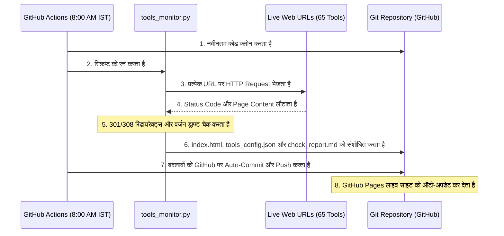

# 📄 AI Tools Directory - Project Report (परियोजना रिपोर्ट)

यह दस्तावेज़ इस प्रोजेक्ट की वास्तुकला (architecture), कार्यक्षमता, और इसके विभिन्न घटकों (components) का संपूर्ण विवरण हिंदी में प्रदान करता है।

---

## 1. प्रोजेक्ट में क्या-क्या है? (Project Structure)
इस प्रोजेक्ट में मुख्य रूप से निम्नलिखित फ़ाइलें और फ़ोल्डर शामिल हैं:

*   **[index.html](file:///d:/CLAUDE%20CODE/ai-tools-directory/index.html)**: यह वेबसाइट का मुख्य चेहरा (Frontend) है। यह एक सिंगल-पेज स्टैटिक HTML फ़ाइल है जिसमें सभी AI टूल्स की सूची, श्रेणियां (categories) और सुंदर CSS डिज़ाइन शामिल है।
*   **[tools_config.json](file:///d:/CLAUDE%20CODE/ai-tools-directory/tools_config.json)**: यह प्रोजेक्ट का डेटाबेस (Database) है। इसमें सभी 65 AI टूल्स के नाम, URL, उनकी वर्तमान स्थिति (active/dead), और उनके वर्जन चेक करने के लिए रेगुलर एक्सप्रेशन (regex) शामिल हैं।
*   **[tools_monitor.py](file:///d:/CLAUDE%20CODE/ai-tools-directory/tools_monitor.py)**: यह इस प्रोजेक्ट का मुख्य इंजन (Engine) है। यह एक पायथन (Python) स्क्रिप्ट है जो सभी लिंक्स को जांचती है, 301/308 रीडायरेक्ट्स को ऑटो-फिक्स करती है और रिपोर्ट तैयार करती है।
*   **[check_report.md](file:///d:/CLAUDE%20CODE/ai-tools-directory/check_report.md)**: स्क्रिप्ट द्वारा ऑटो-जेनरेटेड रिपोर्ट। इसमें लिखा होता है कि कितने टूल्स सही चल रहे हैं, कौन से ब्लॉक हैं, और कहाँ वर्जन अपडेट की जरूरत है।
*   **[.github/workflows/daily-check.yml](file:///d:/CLAUDE%20CODE/ai-tools-directory/.github/workflows/daily-check.yml)**: यह ऑटोमेशन सिस्टम है। यह GitHub Actions का उपयोग करके हर सुबह ठीक 8:00 AM IST पर पायथन स्क्रिप्ट को चलाता है।
*   **[requirements.txt](file:///d:/CLAUDE%20CODE/ai-tools-directory/requirements.txt)**: पायथन स्क्रिप्ट के लिए आवश्यक बाहरी लाइब्रेरीज़ (dependencies) की लिस्ट।
*   **[.gitignore](file:///d:/CLAUDE%20CODE/ai-tools-directory/.gitignore)**: वह फ़ाइल जो संवेदनशील फ़ाइलों (जैसे API keys, IDE configs) को GitHub पर जाने से रोकती है।

---

## 2. यह कैसे बना है? (Technology Stack)
इस प्रोजेक्ट को सरल, तेज और बिना किसी महंगे सर्वर के चलाने के लिए डिज़ाइन किया गया है:

1.  **Frontend (वेबसाइट)**: HTML5 और मॉडर्न CSS3 (बिना किसी भारी फ्रेमवर्क जैसे React या Tailwind के, जिससे लोडिंग स्पीड बहुत तेज़ रहती है)।
2.  **Scripting & Parsing**: Python 3 का उपयोग करके, जिसमें `requests` लाइब्रेरी वेब पेजों को डाउनलोड करती है और `BeautifulSoup4` HTML को पार्स करती है।
3.  **Automation & Hosting**: GitHub Actions (मुफ़्त क्लाउड रनर) और GitHub Pages (मुफ़्त स्टैटिक होस्टिंग)।

---

## 3. यह क्या काम करता है? (Core Capabilities)
*   **लिंक्स की जांच (Link Checking)**: यह सभी 65 लिंक्स पर रिक्वेस्ट भेजकर जाँचता है कि क्या वे लाइव हैं।
*   **स्वचालित सुधार (Auto-fixing Redirects)**: यदि कोई वेबसाइट अपना डोमेन बदलती है (जैसे `chat.openai.com` से `chatgpt.com`), तो स्क्रिप्ट स्वचालित रूप से `index.html` और `tools_config.json` में नया लिंक अपडेट कर देती है।
*   **तारीख अपडेट (Date Auto-update)**: जब भी कोई बदलाव होता है, वेबसाइट के शीर्ष पर "Last Updated: [Date]" को स्वतः ही आज की तारीख से बदल दिया जाता है।
*   **वर्जन चेक (Version Monitoring)**: कुछ मुख्य टूल्स के वेबपेज पर जाकर यह जांचता है कि कहीं कोई नया वर्जन नंबर तो नहीं लिखा है (जैसे Suno v5.5 या Midjourney V8.1)।
*   **रिपोर्ट जेनरेशन (Detailed Reporting)**: पूरी जांच के बाद `check_report.md` फ़ाइल अपडेट होती है ताकि एडमिन देख सके कि प्रोजेक्ट का क्या स्टेटस है।

---

## 4. यह क्या नहीं करता है? (Limitations)
*   **Cloudflare/Anti-Bot बाईपास नहीं करता**: जो वेबसाइट्स बॉट्स को ब्लॉक करती हैं (जैसे Claude, Perplexity), उनका वास्तविक HTML कोड पायथन सामान्य रिक्वेस्ट से नहीं पढ़ पाता (ये 403 Forbidden एरर देती हैं)। इनका वर्जन मैन्युअली देखना पड़ता है।
*   **लॉगिन-आधारित पेजों की जांच नहीं करता**: यह केवल उन पेजों को देख सकता है जो बिना लॉगिन के इंटरनेट पर उपलब्ध हैं।
*   **विजुअल चेंज डिटेक्शन नहीं करता**: यह केवल कोड और टेक्स्ट देखता है, वेबसाइट के अंदर का डिज़ाइन या बटन काम कर रहे हैं या नहीं, यह नहीं जाँच सकता।

---

## 5. फ्रंट एंड (Frontend) क्या है?
फ्रंटएंड पूरी तरह से यूजर इंटरफेस (UI) है जिसे यूजर देखता है:
*   यह **डार्क-थीम (sleek dark mode)** डिज़ाइन है जिसमें ग्लासमोर्फिज़्म (subtle transparency) और आकर्षक कलर ग्रेडिएंट्स का इस्तेमाल किया गया है।
*   सभी टूल्स को **12 श्रेणियों** (💬 AI Assistants, 🎨 Image Gen, 📹 Video Gen, 💻 Coding, आदि) में विभाजित किया गया है।
*   प्रत्येक टूल के पास बजट और उपलब्धता बताने वाले **रंगीन बैज (Badges)** हैं:
    *   `FREE`: बिना क्रेडिट कार्ड के मुफ़्त।
    *   `BUDGET`: $15/महीने से कम।
    *   `TRIAL`: मुफ़्त ट्रायल उपलब्ध।
    *   `OPEN`: ओपन-सोर्स मॉडल।
    *   `🔥 HOT`: 2026 में ट्रेंडिंग।
*   शीर्ष पर एक **Instagram Follow Button** और फूटर में **Created by @hackthealgorithm.in** का लिंक जोड़ा गया है।

---

## 6. बैक एंड (Backend) क्या है?
इस प्रोजेक्ट में कोई पारंपरिक डेटाबेस या सर्वर-साइड लैंग्वेज (जैसे Node.js, PHP या SQL) नहीं है। इसका बैकएंड पूरी तरह से **सर्वरलेस पायथन स्क्रिप्ट और GitHub Actions** पर आधारित है:
*   **डेटा स्टोरेज**: `tools_config.json` फ़ाइल ही डेटाबेस का काम करती है।
*   **बैकएंड लॉजिक**: `tools_monitor.py` जो कि बैकएंड स्क्रिप्ट है।
*   **बैकएंड सर्वर**: GitHub का क्लाउड कंटेनर (Ubuntu Runner) जो दैनिक रूप से स्क्रिप्ट चलाता है।

---

## 7. चीजें कैसे काम कर रही हैं? (Detailed Workflow)

यहाँ हर सुबह होने वाली प्रक्रिया का चरण-दर-चरण विवरण दिया गया है:

1.  **सुबह 8:00 बजे (IST)**: GitHub Actions सक्रिय होता है और क्लाउड सर्वर पर प्रोजेक्ट की फ़ाइलें लोड करता है।
2.  **स्क्रिप्ट निष्पादन (Execution)**: पायथन स्क्रिप्ट सभी 65 वेबसाइट्स पर रिक्वेस्ट भेजती है।
3.  **चेकिंग और अपडेट**: 
    *   यदि कोई यूआरएल बदल गया है, तो वह `index.html` के लिंक को अपडेट करती है।
    *   वह `index.html` में "Last Updated" की तारीख को आज की तारीख में बदल देती है।
    *   यदि किसी टूल का नया वर्जन मिलता है, तो वह रिपोर्ट में लिख देती है।
4.  **ऑटो-कमिट**: GitHub Actions इन सभी अपडेटेड फ़ाइलों को आपके गिटहब रिपोजिटरी में `github-actions[bot]` नाम से पुश कर देता है।
5.  **लाइव रिफ्रेश**: जैसे ही रिपोजिटरी में नया कोड जाता है, GitHub Pages सक्रिय होता है और लाइव लिंक [https://shanuuikey1.github.io/LATEST-AI-TOOLS-DIRECTORY/](https://shanuuikey1.github.io/LATEST-AI-TOOLS-DIRECTORY/) पर नई वेबसाइट पब्लिश कर देता है।
